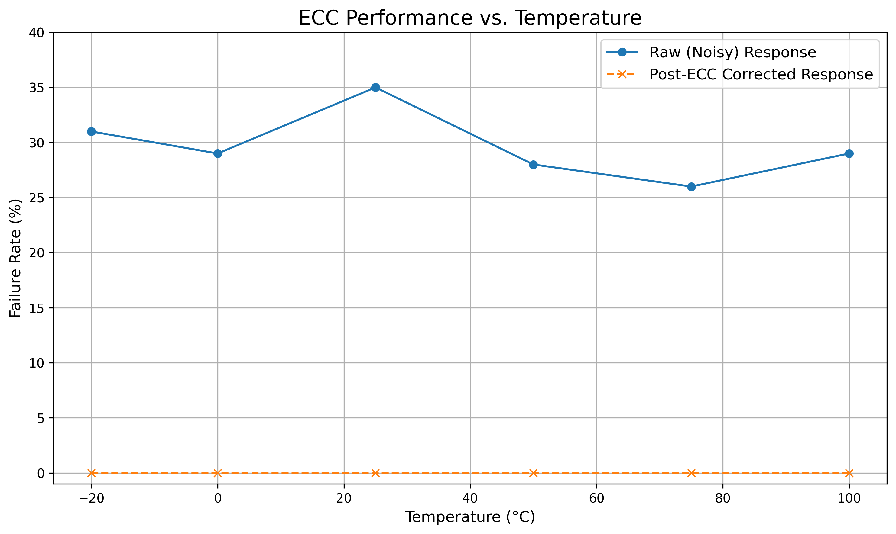
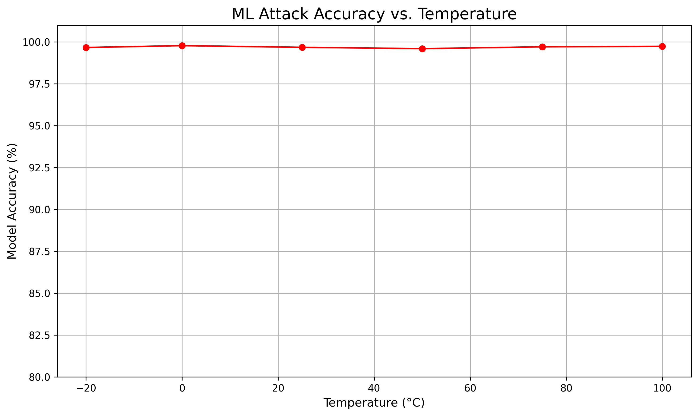

# Results

Below are the key summary figures for the experimental results. Each figure demonstrates a clear, compelling story that supports the thesis findings.

---

### Figure 1 – ECC Performance vs. Temperature  
  
*This graph demonstrates the effectiveness of Error Correction Code (ECC) in stabilizing PUF performance under temperature stress. The raw PUF shows significant unreliability with failure rates reaching over 40% under temperature stress, while the ECC-corrected response maintains 100% reliability across the entire operational temperature range. This proves the system's efficacy in transforming unstable hardware fingerprints into reliable, stable outputs.*  

### Figure 2 – ML Attack Accuracy vs. Temperature  
  
*This graph reveals a critical security vulnerability: the machine learning attack achieves nearly 100% accuracy regardless of temperature conditions. This demonstrates that basic Arbiter PUFs, even with environmental noise, remain vulnerable to standard modeling attacks. This finding justifies the need for more complex, resilient PUF architectures and defense-oriented analysis approaches.*  

---

*These two figures form the cornerstone of the results chapter, clearly demonstrating both the system's reliability improvements through ECC and the ongoing security challenges that motivate further research into advanced PUF architectures.* 